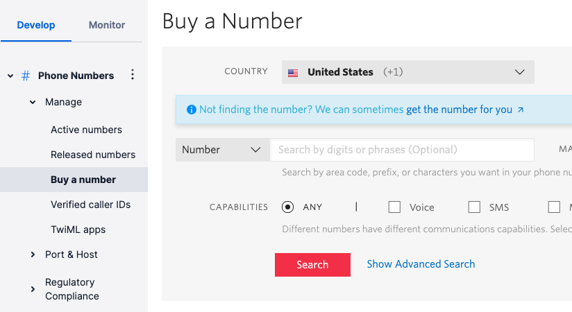

# TWILIO VOICE CHATBOT INTEGRATION

### TABLE OF CONTENTS

- [Introduction](#introduction)
- [Features](#features)
- [Building the Twilio Voice Connector](#building-the-twilio-voice-connector)
  - [Required Configuration](#required-configuration)
  - [Optional Configuration](#optional-configuration)
  - [ESCALATION (chat.php)](#escalation-chatphp)
  - [CONVERSATION (conversation.php)](#conversation-conversationphp)
  - [ENVIRONMENTS (environments.php)](#environments-environmentsphp)
  - [Deployment](#deployment)
- [Twilio Voice Configuration](#twilio-voice-configuration)
  - [Account](#account)
  - [Autopilot](#autopilot)
    - [Intents](#intents)
    - [Account and Assistant SID](#account-and-assistant-sid)
  - [Voice Configuration](#voice-configuration)
  - [Escalation (phone transfer)](#escalation-phone-transfer)
  - [Tests](#tests)
- [Prepare your Inbenta instances](#prepare-your-inbenta-instances)
  - [Text Content](#text-content)

# **Introduction**

You can extend Inbenta’s chatbot capabilities to voice with this connector to integrate with [Twilio Voice](https://www.twilio.com/voice).

# **Features**

The following features of Inbenta’s chatbot are supported in the Twilio Voice integration:

- Answer Text.
- Sidebubble.
- Multiple options.
- Polar Questions.
- Dialogs.
- Forms, Actions & Variables (Keep in mind we are using voice as a channel. So, not all variable types work best with voice. Example: Email, Date).

# **Building the Twilio Voice Connector**

## **Required Configuration**

In your UI directory, go to **conf**. Here, you have a readme file with some structure and usage explanations.

Fill the **key** and **secret** values inside the **conf/custom/api.php** file with your Inbenta Chatbot API credentials ([Here](https://help.inbenta.com/en/general/administration/managing-credentials-for-developers/finding-your-instance-s-api-credentials/) is the documentation on how to find the key and secret from Inbenta’s backstage. Use the same credentials as backstage to access the article).

## **Optional Configuration**

There are some optional features (see the list below) that can be enabled from the configuration files. Every optional configuration file should be copied from **/conf/default** and store the custom version in **/conf/custom**. The bot will detect the customization and it will load the customized version.

## **ESCALATION (CHAT.php)**

-   **chat** 
    -   **enabled**: Enable or disable escalation (“**true**” or “**false**”).
-   **triesBeforeEscalation**: Number of no-result answers in a row after the bot should escalate to an agent (if available). Numeric value, not a string. Zero means it’s disabled.
-   **negativeRatingsBeforeEscalation**: Number of negative content ratings in a row after the bot should escalate to an agent (if available). Numeric value, not a string. Zero means it’s disabled.

## **CONVERSATION (conversation.php)**

- **default:** Contains the API conversation configuration. The values are described below:
  - **answers:**
    - **sideBubbleAttributes:** Dynamic settings to show side-bubble content. Because there is no side-bubble in Twilio Voice the content is shown after the main answer.
    - **answerAttributes:** Dynamic settings to show as the bot answer. The default is [ "ANSWER_TEXT" ]. Setting multiple dynamic settings generates a bot answer with concatenated values with a newline character (\n).
    - **maxOptions:** Maximum number of options returned in a multiple-choice answer.
  - **forms**
    - **allowUserToAbandonForm:** Whether or not a user is allowed to abandon the form after a number of consecutive failed answers. The default value is **true**.
    - **errorRetries:** The number of times a user can fail a form field before being asked if he wants to leave the form. The default value is 3.
  - **lang:** Language of the bot, represented by its ISO 639-1 code. Accepted values: ca, de, en, es, fr, it, ja, ko, nl, pt, zh, ru, ar, hu, eu, ro, gl, da, sv, no, tr, cs, fi, pl, el, th, id, uk
- **user_type**: Profile identifier from the Backstage knowledge base. Minimum:0\. Default:0\. You can find your profile list in your Chatbot Instance → Settings → User Types.
- **source**: Source identifier (default value **twilio voice**) used to filter the logs in the dashboards.

## **ENVIRONMENTS (environments.php)**

This file allows configuring a rule to detect the current environment for the connector, this process is made through the URL where the application is running. It can check the current **http_host** or the **script_name** in order to detect the environment.

- **development:**
  - **type**: Detection type: check the **http_host** (e.g. [_www.example.com_](http://www.example.com/)) or the **script_name** (e.g. _/path/to/the/connector/server.php_).
  - **regex**: Regex to match with the detection type (e.g. “_/^dev.mydomain.com$/m_“ will set the “development” environment when the detection type is [_dev.example.com_](http://dev.example.com/)).

## **Deployment**

The Twilio Voice template must be served by a public web server in order to allow Twilio Voice to send the events to it. The environment where the template has been developed and tested has the following specifications

- Apache 2.4
- PHP 7.3
- PHP Curl extension
- Non-CPU-bound
- The latest version of [**Composer**](https://getcomposer.org/) (Dependency Manager for PHP) to install all dependencies that Inbenta requires for the integration.
- If the client has a **distributed infrastructure**, this means that multiple servers can manage the user session, they must adapt their SessionHandler so that the entire session is shared among all its servers.

# Twilio Voice Configuration

## Account

Log in or Sign Up into your Twilio Account https://www.twilio.com/login:


> **NOTE** For the next set of instructions images, the new Twilio Console was used (in beta version at the moment of creation of this document (07/23/2021)). You can activate it by clicking in the button "Try the beta Console":


## Autopilot

Once you are logged in, go to "Explore Products", in the left menu, and then search for **Autopilot**. Click on **Autopilot**:


Select **Autopilot → Build a bot** menu and then click on "**Start from scratch**" button:


Add a unique name and a description for the bot. Click on "Create bot":


### Intents

The purpose of this step is to be sure that every intent received by Twilio is redirected to Inbenta to get a response form the chatbot.

In your bot options, go to **Tasks** and for every existing Task (except _collect_fallback_) click on **Program**:


In the new window, select **Actions URL**:


**Add the connector URL**

In the input box "_Fetch your JSON from:_", replace the default value with the URL of the server where this connector is hosted (with option **POST** selected):


### Account and Assistant SID

Go to **Settings** and copy the SIDs values (Assistant SID and Account SID). You have to update the SID values in **conf/custom/twilio.php** file


```php
return [
    'credentials' => [
        'account_sid' => '',
        'assistant_sid' => ''
    ],
    'transfer_function_url' => '' //Twilio function to make the transfer with an agent
];
```

## Voice configuration

Go to **Channels** and then click on **Programmable Voice**:


From the "Configuration" tab, copy the **VOICE URL**, this value will be needed in the next step:


You'll need a phone number to link with your bot. For this, go to the Dashboard and click in "Explore Products" and search for **Phone Numbers**


Click on "Phone Numbers → Manage → Buy a number" and Search for a number (depending on your Country / Zone):



You can buy any of the available phone numbers:


> Note: You can skip this buying process if you have an active number already.

Once you have completed the phone number buying process, click on "Phone Numbers → Manage → Active numbers", and then click on the phone number that you recently bought:


In "Voice → A CALL COMES IN" section select **Webhook**, and paste the value of the **VOICE URL** (see **Voice configuration** step), with the option HTTP POST selected


## Escalation (phone transfer)

This Twilio Voice Connector has the ability to transfer a user's call from Chatbot to a predefined phone number. To do so, next configuration is required:

In Twilio console, in the left menu, click on **Explore Products** and then search for **Functions**:


In the new menu of "Functions" click on **Overview** and then in **Create Service** button:


Add a new name to the service (for this example: _inbenta_) and click in **Next** button:


Once the previous step is done, you should be redirected to a screen with the details of the recently created service. There, you need to click in **Add +** button and then **Add Function**:


Set a name for the function, for this example: _/agentTransfer_


> Remember that function names cannot contain spaces or special characters: |;,?:@=&$()'

Copy and paste the provided code for the function ([agentTransferFunction.js](#public/agentTransferFunction.js)) adding the phone number where you want to be transferred to when escalation occurs (in code, variable **poneNumber** in line 13). Click on **Save** button:


When the function is saved, you must make it publicly available. Click on the down arrow of your new function (in this case _/agentTransfer_) and select **Public** (by default is _Protected_):


Once your function is changed to Public, you'll need to deploy it. Click on **Deploy All** button:


When previous step is completed, click in the 3 vertical dots of the function (_/agentTransfer_), an then click in **Copy URL**:


This URL is needed to execute the escalation when is required. You'll paste this URL value in file **twilio.php**, in variable **transfer_function_url**:

```php
return [
    'credentials' => [
        'account_sid' => '',
        'assistant_sid' => ''
    ],
    'transfer_function_url' => 'FUNCTION-URL' //Twilio function to make the transfer with an agent
];
```

## Tests

In order to validate everything is properly configured, go to "Autopilot → Your bots" menu:


Select the bot you created. Once you are in the bot options, click on **Simulator**. You can test your bot using a _Text simulator_:


Or _Voice call simulator_:


# Prepare your Inbenta instances

## Text Content

We should always keep in mind that user interaction is going to be through voice.

Hence, content should be simple text: **avoid the use of HTML tags, multimedia and URLs**. This is especially important if you are using Voice template, most of the HTML tags are not recognized by the TTS (Text-To-Speech) services.

Note: “**Natural Language Search**” is the best **Transition type** for dialogs.
